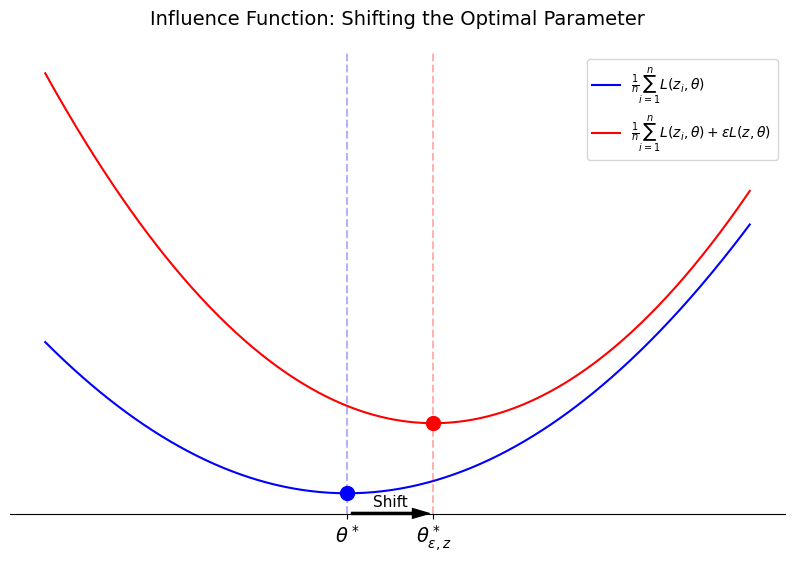

# Understanding Black-box Predictions via Influence Functions

> 2017 ICML

이 논문에서는 학습데이터 $z_1, z_2, \ldots, z_n$에서 특정 데이터 $z$를 학습에서 제외했을 때 파라미터가 어떻게 변화하는지 예측하기 위한 approximation을 탐구한다. 

## Notations 

- Data point: $z$
- parameters: $\theta \in \Theta$
- Loss function: $L(z, \theta)$
- Empirical risk: $\frac{1}{n}\sum_{i=1}^n L(z_i, \theta)$
- Optimal parameter: $\theta^* = \mathop{\arg\min}\limits_{\theta \in \Theta} \frac{1}{n} \sum_{i=1}^n L(z_i, \theta)$

## 1. Upweighting a data point

목표: Data point $z$가 모델의 예측에 미치는 영향을 알아보는 것 $\leftrightarrow$ Data point $z$가 없다면 모델의 예측이 어떻게 변화되는가?

특정 데이터 $z$ 없이 학습한 모델 파라미터를 $\theta_{-z}$라고 하자. $\theta_{-z}$는 다음과 같이 정의할 수 있다:

\begin{equation}
\theta^*_{-z} = \mathop{\arg\min}\limits_{\theta \in \Theta} \sum_{z_i \neq z}L(z_i, \theta)
\end{equation}

이 방법으로 $z$가 학습에 참여하지 않았을 경우 실제로 파라미터가 어떻게 변하는지 $\Delta \theta^* = \theta^*_{-z} - \theta^*$를 통해 계산할 수 있지만, 모든 데이터 $z$에 대해 이 연산을 모두 진행하는 것은 불가능에 가깝다. 

이러한 문제점을 바탕으로 influence function을 활용한다. 만약 $z$가 아주 작은 크기 $\epsilon$으로 upweighted되어 있다면, upweighted된 파라미터를 다음과 같이 정의할 수 있다.

$$ \theta^*_{\epsilon, z} \equiv \mathop{\arg \min}\limits_{\theta \in \Theta} \Big[ \frac{1}{n} \sum_{i=1}^n L(z_i, \theta) + \epsilon L(z, \theta)\Big]$$

이제, 파라미터 $\theta^*$에서 $\epsilon$으로 upweighting된 $z$가 파라미터에 미치는 영향을 $\mathcal{I}_\text{up, params}(z)$ 라고 하면, Newton's step을 활용하여 다음과 같이 나타낼 수 있다.

\begin{equation}
\mathcal{I}_\text{up, params}(z) \equiv \lim_{\epsilon \to 0} \frac{\theta^*_{\epsilon, z} - \theta^*}{\epsilon} = \frac{d \theta^*_{\epsilon, z}}{d \epsilon} \Big|_{\epsilon=0} = - H^{-1}_{\theta^*} \nabla_\theta L(z, \theta^*)
\end{equation}

Influence function 유도

<b>1. Taylor Expansion</b>  
식(2)는 데이터 $z$가 $\epsilon$만큼 추가되어 $\theta^*$가 더이상 최적의 파라미터가 아닐 때, 다시 최적의 파라미터 $\theta^*_{\epsilon}$을 찾기 위해서는 얼마나 움직여야 하는지를 찾는 것이다.   
우리는 이미 전체 데이터 $z_1, z_2, \ldots, z_n$에 대한 최적의 파라미터 $\theta^*$를 알고 있다. 이 지점에서 전체 손실함수인 empirical risk $R(\theta) = \frac{1}{n} \sum L(z_i, \theta)$의 기울기는 0이다. 데이터 $z$가 $\epsilon$만큼 추가된 새로운 손실함수 $R_{\epsilon}(\theta) = R(\theta) + \epsilon L(z, \theta)$는 $\theta^*$에서의 기울기가 0이 아니다. 이때, Newton's step은 현재 위치의 기울기를 Hessian으로 나누어 새로운 최소값으로 이동하는 방법이다.   
$\theta^*_{\epsilon, z}$를 $R_{\epsilon}(\theta)$에서의 optimal parameter라고 정의하자. 이 지점에서의 기울기는 0이여야 하므로 다음이 성립한다. 
$$\nabla_\theta R_{\epsilon}(\theta^*_{\epsilon, z} )= \nabla_\theta R(\theta^*_{\epsilon, z}) + \epsilon \nabla_\theta L(z, \theta^*_{\epsilon, z}) = 0 $$
$ \epsilon$이 매우 작을 때, $\theta^*$와 $\theta^*_{\epsilon, z}$는 근처에 있다고 가정하고, $\theta^*$에서의 테일러 전개를 통해 이를 표현하면, 
$$0 \approx [\nabla_\theta R(\theta^\ast) + \epsilon \nabla_\theta L(z, \theta^\ast)] + [\nabla_\theta^2 R(\theta^\ast) + \epsilon \nabla_\theta^2 L(z, \theta^\ast)] (\theta^\ast_{\epsilon, z} - \theta^\ast) $$
을 얻는다. 
여기에서, $\theta^*$는 $R(\cdot)$을 최소화하는 파라미터이기 때문에 $\nabla_\theta R(\theta^*) = 0$이라는 것을 알 수 있으며, 
$$ 0 \approx \epsilon\nabla_\theta L(z, \theta^*) + [\nabla_\theta^2 R(\theta^*) + \epsilon \nabla_\theta^2 L(z, \theta^*)] (\theta_{\epsilon, z}^* - \theta^*) $$
를 얻고, 이를 정리하면
$$ \frac{\theta_{\epsilon, z}^* - \theta^*}{\epsilon} \approx  -[\nabla_\theta^2 R(\theta^*) + \epsilon \nabla_\theta^2 L(z, \theta^*)]^{-1} L(z, \theta^*) $$
를 구할 수 있다. $\nabla_\theta^2 R(\theta) = H_\theta$ 이고, $\lim\limits_{\epsilon \to 0} \epsilon \nabla^2_\theta R(\theta^*) = 0$이므로,
$$ \lim_{\epsilon \to 0} \frac{\theta_{\epsilon, z}^* - \theta^*}{\epsilon} = \frac{d\theta^*_{\epsilon, z}}{d\epsilon}\Big|_{epsilon=0} = -H^{-1}_{\theta^*} \nabla_\theta L(z, \theta^*)$$
식 (2)를 유도할 수 있다.   
<b>2. Derivation</b>  
동일하게,
$$\nabla_\theta R_{\epsilon}(\theta^*_{\epsilon, z} )= \nabla_\theta R(\theta^*_{\epsilon, z}) + \epsilon \nabla_\theta L(z, \theta^*_{\epsilon, z}) = 0 $$
가 성립한다. 따라서 다음 또한 성립한다.
$$\frac{d}{d\epsilon}\Big[\nabla_\theta R(\theta^*_{\epsilon, z}) + \epsilon \nabla_\theta L(z, \theta^*_{\epsilon, z})\Big] = 0$$
$$\frac{d\theta^*_{\epsilon, z}}{d\epsilon}\frac{d}{d\theta^*_{\epsilon, z}}\Big[\nabla_\theta R(\theta^*_{\epsilon, z}) + \epsilon \nabla_\theta L(z, \theta^*_{\epsilon, z})\Big] = 0$$
$$\frac{d\theta^*_{\epsilon, z}}{d\epsilon}\nabla^2_\theta R(\theta^*_{\epsilon, z}) + \nabla_\theta L(z, \theta^*_{\epsilon, z}) + \epsilon \frac{d\theta^*_{\epsilon, z}}{d\epsilon}\nabla^2_\theta L(z, \theta^*_{\epsilon, z}) = 0$$
이제 $\epsilon \to 0$을 적용하면, $\theta^*_\epsilon \to \theta^*$이고
$$\lim_{\epsilon\to 0} \Big[\frac{d\theta^*_{\epsilon, z}}{d\epsilon}\nabla^2_\theta R(\theta^*_{\epsilon, z}) + \nabla_\theta L(z, \theta^*_{\epsilon, z})\Big] = H_{\theta^*}\frac{d\theta^*_{\epsilon, z}}{d\epsilon}\Big|_{\epsilon=0} + \nabla_\theta L(z, \theta^*) = 0 $$
이다. 따라서 
$$\left. \frac{d\theta^*_{\epsilon, z}}{d\epsilon} \right|_{\epsilon=0} = -H_{\theta^*}^{-1} \nabla_\theta L(z, \theta^*)$$
가 성립한다.

|  |
|:--|
| **Figure 1.**  Visualization of Parameter Shift via Influence Function. 새로운 데이터 $z$의 유입에 따른 손실 함수의 변화와 그로 인한 최적 파라미터 $\theta^*$의 이동. Influence function은 원래의 최적점에서의 Hessian과 기울기를 이용해 이 이동 거리를 예측한다.|

Figure 1은 데이터 $z$가 추가됨에 따라 손실 함수의 surface가 변하고, 이에 따른 최적 파라미터 $\theta^*$가 $\theta^*_{\epsilon, z}$로 변하는 과정을 시각화한다. 여기에서, $\nabla_\theta L(z, \theta^*)$는 $\theta^*$ 지점에서 빨간색 곡선의 기울기를 나타내 ($\because \nabla_\theta R(\theta^*) = 0$) 이동할 방향성을 제시하며, influence function은 이 기울기와 지형의 곡률(Hessian)을 결합하여 최종 이동 거리와 방향을 예측한다.

식(1)에서, data point $z$의 영향을 삭제하는 것은 $\epsilon$을 $\frac{1}{n}$로 weighting하는 것과 동일하기 때문에, 선형 근사를 통해 data point $z$를 삭제했을 때의 파라미터 변화를 다음과 같이 approximate할 수 있다. 

$$ \theta^*_{-z} - \theta^* \approx -\frac{1}{n} \mathcal{I}_\text{up, params}(z)$$

$\mathcal{I}_\text{up, params}$를 통해 $z$의 upweighting에 따라 $\theta$가 얼마나 변하는지 측정할 수 있었다. 이제 $z$를 upweighting했을 때 test point $z_\text{test}$에 대하여 loss가 어떻게 변하는지를 chain rule을 통해 $\mathcal{I}_\text{up, loss}$를 정의하여 나타낸다. 

\begin{equation}
\begin{aligned}
\mathcal{I}_\text{up, loss} &\equiv \frac{d L(z_\text{test}, \theta^*_{\epsilon, z})}{d\epsilon} \Big|_{\epsilon = 0} \\\\
& = \nabla_\theta L(z_\text{test}, \theta^*)^\top \frac{d\theta^*_{\epsilon, z}}{d\epsilon}\Big|_{\epsilon = 0} \\\\
& = -\nabla_\theta L(z_\text{test}, \theta^*)^\top H^{-1}_{\theta^*}\nabla_\theta L(z, \theta^*)
\end{aligned}
\end{equation}

## 2. Perturbing a training input

지금까지는 data point $z$ 단위에서의 분석을 진행했다면, feature 단위로 좁혀서 분석해보자. 아주 작은 noise가 추가된 data point를 $z_\delta$라고 하자. 

$$ z_\delta \equiv (x+\delta, y)$$ 

이렇게 perturbation을 통해 얻은 $z_\delta$가 있을 때, $z$ 대신 $z_\delta$를 포함한 training points에 대한 emperical risk minimizer를 $\theta^*_{z_\delta, -z}$라고 하자. 즉, $z$라는 학습 데이터를 제거하고, $z$를 살짝 수정한 $z_\delta$를 학습에 활용했을 때의 최적 파라미터를 $\theta^*_{z_\delta, -z}$라고 해보자. 

여기에서, 한 번에 데이터 $z$를 $z_\delta$로 수정하게 되면 미분이 불가능하다. $\epsilon$을 아주 작은 질량이라고 생각하고, $z$의 질량을 $z_\delta$로 옮긴다고 생각해보자. $z$의 질량은 $\epsilon$만큼 삭제하고, $z_\delta$의 질량을 $\epsilon$만큼 추가했을 때의 emperical risk minimizer $\theta^*_{\epsilon, z_\delta, -z}$는 다음과 같이 정의된다.

$$ \theta^*_{\epsilon, z_\delta, -z} \equiv \mathop{\arg\min}\limits_{\theta \in \Theta} \Big[\frac{1}{n} \sum_{i=1}^n L(z_i, \theta) + \epsilon L(z_\delta, \theta) - \epsilon L(z, \theta)\Big] $$

식(2)에서 정의한 바와 같이 $z_\delta$를 $\epsilon$만큼 추가했을 때의 영향력을 $\mathcal{I}_\text{up, params}(z_\delta)$, $z$를 $\epsilon$만큼 추가했을 때의 영향력을 $\mathcal{I}_\text{up, params}(z)$라고 하면, $\epsilon$에 따른 $z_\delta$의 추가와 $z$ 제거로 인해 파라미터가 변하는 정도 $\frac{d \theta^*_{\epsilon, z_\delta, z}}{d\epsilon}$는 다음과 같이 표현할 수 있다.

\begin{aligned}
\frac{d \theta^*_{\epsilon, z_\delta, z}}{d\epsilon} &= \mathcal{I}_\text{up, params}(z_\delta) - \mathcal{I}_\text{up, params}(z)\\
&= - H^{-1}_{\theta^*}\big(\nabla_\theta L(z_\delta, \theta^*) - \nabla_\theta L(z, \theta^*)\big)
\end{aligned}

입력데이터 $x$가 continuous이고 $\delta$가 충분히 작다고 하자. input domain $\mathcal{X} \subseteq \mathbb{R}^d$, parameters $\Theta \subseteq \mathbb{R}^p$ 이고, $L$이 $\theta$와 $x$에 대해 미분 가능하면, 선형 근사에 의해 다음이 성립한다.

$$\nabla_\theta L(z_\delta, \theta^*) - \nabla_\theta L(z, \theta^*) \approx [\nabla_x \nabla_\theta L(z, \theta^*)]\delta$$

이를 통해 $\frac{\theta^*_{\epsilon, z_\delta, -z}}{d\epsilon}$을 근사하면, 

$$ \frac{\theta^*_{\epsilon, z_\delta, -z}}{d\epsilon} \Big|_{\epsilon=0} \approx -H^{-1}_{\theta^*}[\nabla_x \nabla_\theta L(z, \theta^*)]\delta $$

이고, $\epsilon = \frac{1}{n}$을 통해 $\theta^*_{z_\delta, -z} - \theta^*$를 근사하면 

$$ \theta^*_{z_\delta, -z} - \theta^* \approx -\frac{1}{n}H^{-1}_{\theta^*}[\nabla_x \nabla_\theta L(z, \theta^*)]\delta$$

이다. Perturbation이 test data의 loss에 미치는 영향력 함수를 $\mathcal{I}_\text{pert, loss}(z, z_\text{test})$를 다음과 같이 정의한다. 

\begin{aligned}
\mathcal{I}_\text{pert, loss}(z, z_\text{test}) &\equiv \nabla_{\delta} L(z_\text{test}, \theta^*_{z_\delta, -z}) |_{\delta = 0}\\
&= \frac{d}{d\theta^*_{z_\delta, -z}}L(z_\text{test}, \theta^*_{z_\delta, -z})^\top\frac{d\theta^*_{z_\delta, -z}}{d\delta} \\
&= \nabla_\theta L(z_\text{test}, \theta^*_{z_\delta, -z})^\top \frac{d\theta^*_{z_\delta, -z}}{d\delta}\\
&= -\frac{1}{n}\nabla_\theta L(z_\text{test}, \theta^*_{z_\delta, -z})^\top H_{\theta^*}^{-1}[\nabla_x \nabla_\theta L(z, \theta^*)]
\end{aligned}

$\mathcal{I}_\text{pert, loss}(z, z_\text{test})$에 $\delta$를 곱하여 입력 데이터를 $z \mapsto z+\delta$로 변경했을 때, $z_\text{test}$의 loss 변화를 추정할 수 있다. 즉, test set에 영향을 많이 주는 noise와 적게 주는 noise를 구분할 수 있다. 

