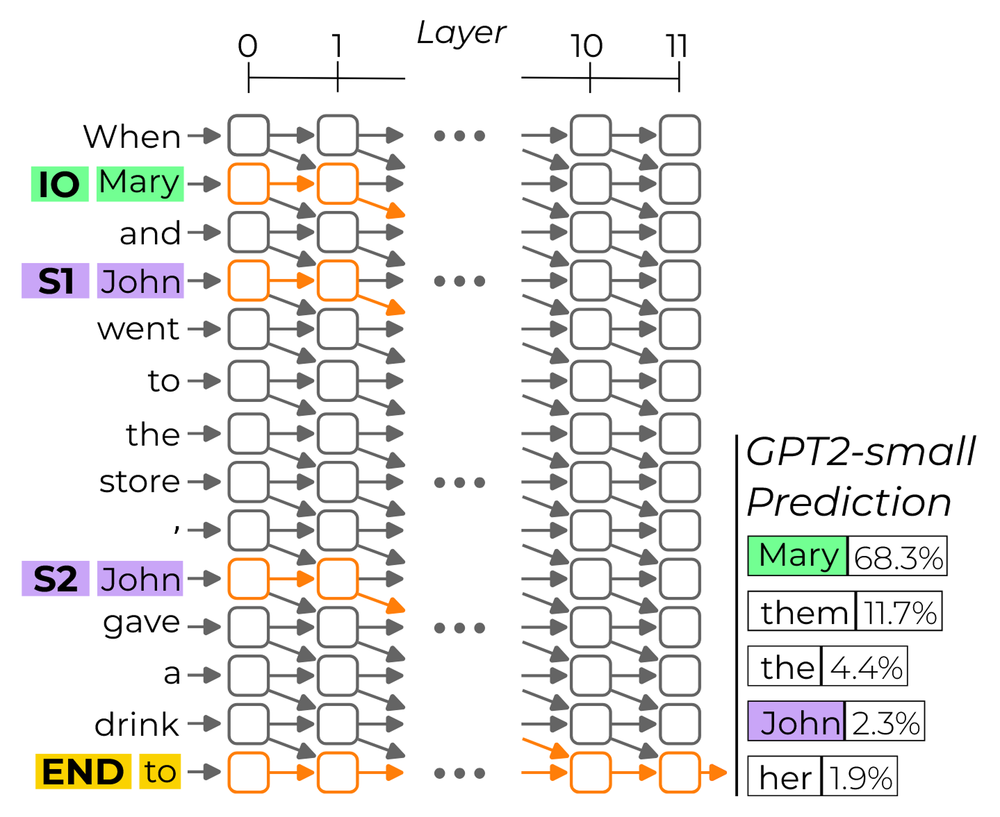

# Indirect Object Identification

##### *Wang et al.* Interpretability In The Wild: A Circuit For Indirect Object Identification In GPT-2 Small *(2023 ICLR)*

## 1. Indirect Object Identification

Indirect Object Identification (IOI) task란?: 간접목적어 (indirect object)를 식별하는 task로, 고정된 템플릿을 사용함으로써 변수를 통제하는 것이 목적으로,
> When <ruby class="io">Mary<rt>IO</rt></ruby> and <ruby class="s">John<rt>S1</rt></ruby> went to the store, <ruby class="s">John<rt>S2</rt></ruby> gave a drink to ____

와 같이 마지막 자리에 들어올 올바른 단어를 고르는 것을 의미한다. 이 연구에서는 IO 토큰과 S 토큰 사이의 logit difference를 주요 metric으로 활용한다. 즉, $\mathrm{logit(IO) - logit(S)}$의 계산을 통해 IO 토큰을 S 토큰보다 선호하면 양수, S토큰을 선호하면 음수가 된다.

이 task를 수행할 때 모델 내부에서 어떤 연산, 동작을 하는지 분석하는 것이 논문의 주요 관점이다.

<figure markdown="span">
  { width="70%" }
  <figcaption>IOI task</figcaption>
</figure>

## 2. Define the Circuits and Knockouts

모델을 computational graph $M$으로 표현한다고 하자. $M$은 module로 이루어진 node (e.g., neurons, attention heads, embeddings)와 interaction을 나타내는 edge (e.g., residual connection, attention)으로 구성된다. 여기에서는 circuit을 특정 행동을 담당하는 $M$의 subgraph $C\subset M$으로 표현한다. 

Knockout은 $M$에서 node의 집합 $K$를 제거하는 것을 의미한다. 여기에서 node를 제거한다는 것을 가장 단순하게 생각해보면 node $K$의 effect가 0이 되는 것 즉, $K$의 ouput이 0이 되는 것을 의미한다. 하지만 실제로 모델에서 0이라는 값은 어떤 의미를 갖는 것이 아니며 분포의 관점에서 봤을 때 자주 등장하지 않는 outlier일 가능성이 있어 이를 강제로 주입하면 noisy한 결과를 얻을 수 있다. 이 문제를 해결하기 위해 mean ablation을 통해 knockout을 진행한다. 여기에서 mean 값은 IO, S1, S2 자리를 서로 다른 세 개의 random name으로 교체하여 얻는다.

모델 $M$을 입력 $x$에 대해 logit을 출력하는 함수 $M(x)$로 정의하고, mean ablation을 통해 $M\setminus C$의 모든 node를 knockout했을 때를 $C(x)$로 정의한다. 