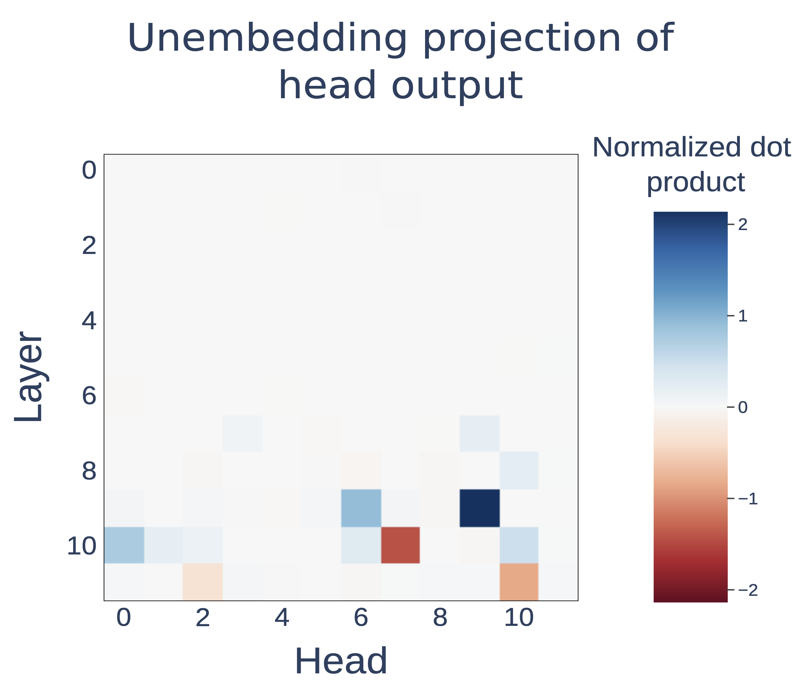
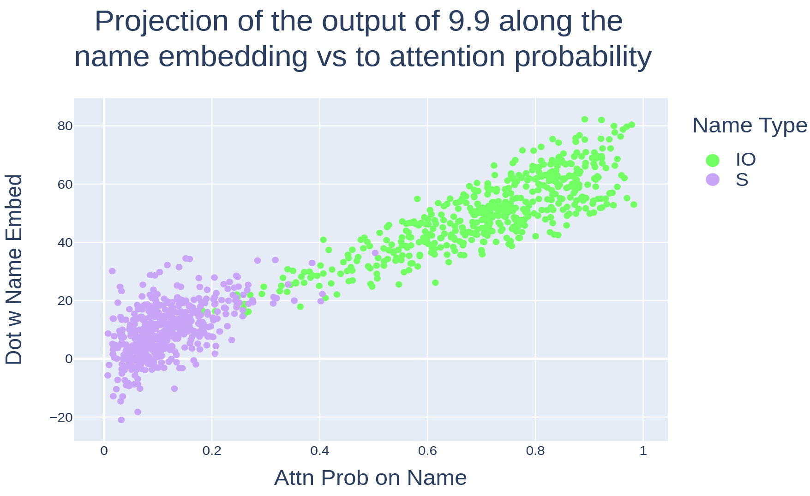
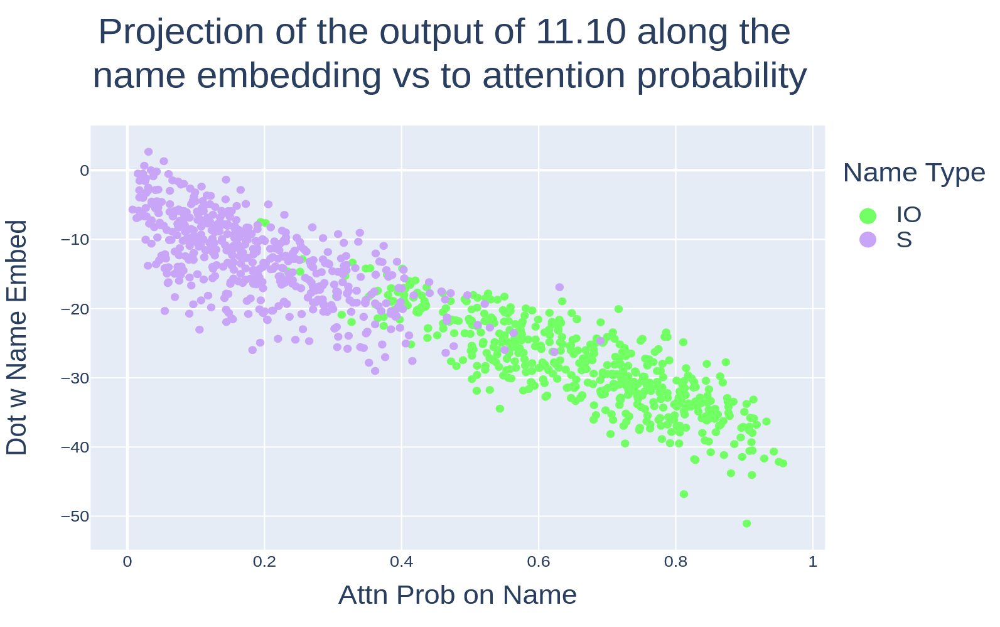

# Indirect Object Identification

##### *Wang et al.* Interpretability In The Wild: A Circuit For Indirect Object Identification In GPT-2 Small *(2023 ICLR)*

## 1. Indirect Object Identification

Indirect Object Identification (IOI) task란?: 간접목적어 (indirect object)를 식별하는 task이다. 고정된 템플릿을 사용함으로써 변수를 통제하는 것이 목적으로,
> When <ruby class="io">Mary<rt>IO</rt></ruby> and <ruby class="s">John<rt>S1</rt></ruby> went to the store, <ruby class="s">John<rt>S2</rt></ruby> gave a drink to ____

와 같이 마지막 자리에 들어올 올바른 단어를 고르는 것을 의미한다. 이 연구에서는 IO 토큰과 S 토큰 사이의 logit difference를 주요 metric으로 활용한다. 즉, $\mathrm{logit(IO) - logit(S)}$의 계산을 통해 IO 토큰을 S 토큰보다 선호하면 양수, S토큰을 선호하면 음수가 된다.

이 task를 수행할 때 모델 내부에서 어떤 연산, 동작을 하는지 분석하는 것이 논문의 주요 관점이다.

<figure markdown="span">
  { width="70%" }
  <figcaption>IOI task</figcaption>
</figure>

## 2. Define the Circuits and Knockouts

모델을 computational graph $M$으로 표현한다고 하자. $M$은 module로 이루어진 node (e.g., neurons, attention heads, embeddings)와 interaction을 나타내는 edge (e.g., residual connection, attention)으로 구성된다. 여기에서는 circuit을 특정 행동을 담당하는 $M$의 subgraph $C\subset M$으로 표현한다. 

Knockout은 $M$에서 node의 집합 $K$를 제거하는 것을 의미한다. 여기에서 node를 제거한다는 것을 가장 단순하게 생각해보면 node $K$의 effect가 0이 되는 것 즉, $K$의 ouput이 0이 되는 것을 의미한다. 하지만 실제로 모델에서 0이라는 값은 어떤 의미를 갖는 것이 아니며 분포의 관점에서 봤을 때 자주 등장하지 않는 outlier일 가능성이 있어 이를 강제로 주입하면 noisy한 결과를 얻을 수 있다. 이 문제를 해결하기 위해 mean ablation을 통해 knockout을 진행한다. 여기에서 mean 값은 IO, S1, S2 자리를 서로 다른 세 개의 random name으로 교체하여 얻는다.

모델 $M$을 입력 $x$에 대해 logit을 출력하는 함수 $M(x)$로 정의하고, mean ablation을 통해 $M\setminus C$의 모든 node를 knockout했을 때를 $C(x)$로 정의한다. 

## 3. Discovering the Circuit

GPT-2 small 모델에서 IOI task를 수행하는 작업을 진행했을 때, 다음과 같이 사람이 이해할 수 있는 순서로 작업을 진행하는 것을 찾을 수 있었다고 한다. 

1. 문장 안에서의 모든 이름을 찾는다 (S1, S2, IO)
2. 중복되는 이름들을 제거한다 (S1, S2)
3. 남아있는 이름을 출력한다 (IO)

특히, 여기에서 7개의 head 이름을 붙여줬는데, 4개의 major heads, 3개의 minor heads로 나눈다.
#### Major Heads
- **Duplicate Token Heads**: 문장에 이미 등장한 토큰을 찾는다. S2 위치의 query가 자신과 동일한 토큰(S1)을 key로 찾아 attend하고(QK), residual stream에 중복된 토큰의 위치 정보를 write한다.
- **S-Inhibition Heads**: Name Mover Head의 attention에서 중복 토큰을 걸러내는 역할을 한다. END 토큰(to)의 query가 S2 토큰의 key에 attend하고, 중복 위치 정보를 읽어 Name Mover Head의 query에 S1/S2로 attention을 억제하도록 write한다.
- **Name Mover Heads**: 기본적으로 문장에서 등장한 name token에 집중하지만, S-Inhibition Heads로 인해 S1과 S2 토큰에 상대적으로 덜 attend한다. 이 head들의 OV matrix는 name copying을 진행하기 때문에 IO token의 logit을 상승시킨다.
- **Negative Name Mover Heads**: Name Mover Heads와 동일하게 name token에 attend하지만, OV matrix가 attend한 토큰을 반대 방향으로 write하여 IO token의 logit을 낮춘다. 결과적으로 prediction의 confidence를 낮추는데, 저자들은 이것이 모델이 틀렸을 경우 큰 loss를 피하기 위한 장치일 수 있다고 추측한다.

#### Minor Heads
- **Previous Token Heads**: S1 토큰의 정보를 바로 다음 토큰(S1+1)으로 복사한다.
- **Induction Heads**: Duplicate Token Heads와 같은 일을 수행하지만, S2 위치에서 S1+1 토큰에 attend한다. 
- **Backup Name Mover Heads**: Name Mover Heads가 knockout 되었을 때 Name Mover Head역할을 한다. $\to$ Name Mover Head를 ablation해도 IOI task의 성능 저하가 적은 결과를 준다.

---
### Name Mover & Negative Name Mover Heads

자 그러면 이제 어떤 방법으로 위의 head들을 찾았는지 확인해보자. 저자들은 먼저 END 토큰 위치에서 head가 residual stream에 writing하는 것을 분석했다. 즉, IOI task에서는 model의 output에 집중한다. 

$W_U$를 unembedding matrix (lm-head), $\overline{LN}$을 layer normalization이라고 하고, $W_U[IO], W_U[S]$가 각각 IO와 S 토큰의 unembedding vector라고 하자. IOI 데이터셋 $\texttt{p}_{IOI}$에 대하여, $h_{i,j}(X)$를 head $(i,j)$가 입력 $X$에 대해 residual stream에 write하는 값이라고 하고,

$$ \lambda_{i,j} := \mathbb{E}_{X\sim \texttt{p}_{IOI}}\left[\left<\overline{LN}\circ h_{i,j}(X), W_U[IO]-W_U[S] \right>\right] $$

로 정의하자. 이 값은 logit lens를 적용하여 각 head에서 측정한 IO 토큰과 S 토큰의 logit 차이로 해석될 수 있다. 즉, $\lambda_{i,j}$가 양수이면, head $(i, j)$는 IO토큰을 S토큰보다 선호한다는 의미를 갖는다.
<figure markdown="span">
  { width="60%" }
</figure>

위 그림은 각 layer, head $(i,j)$에 따른 $\lambda_{i,j}$를 보여주는데, $|\lambda|$값이 큰 head는 모두 후반부 레이어에 모여있는 것을 확인할 수 있다.

<figure markdown="span">
  { width="70%" }
</figure>

양의 $\lambda$값을 갖는 head의 attention score를 분석해 보았을때, IO 토큰에서 큰 attention probability를 보인다. 또한, 가장 큰 $\lambda$값을 갖는 $(9, 9)$ head의 attention probability와 name 토큰의 logit score를 확인해보면, 강한 양의 상관관계를 보인다. 이를 바탕으로 이 head들은 name token에 attend하며, residual stream으로 이 토큰을 copy한다고 분석할 수 있다. 이 head들이 Name Mover Heads이다.

저자들은 추가적으로 Name Mover Heads의 OV circuit을 통해 stream에 어떤 내용이 쓰여지는지 확인하기 위해 첫번째 레이어의 name token output에 OV matrix를 projection하여 logit을 계산했다. 95% 이상이 name token을 top-5 logit에 예측하는 것을 확인하였는데 (평균 head는 20% 미만), copy mechanism을 뒷받침한다. 

<figure markdown="span">
  { width="70%" }
</figure>
반면, 음의 $\lambda$값을 갖는 head들은 $W_U[IO] - W_U[S]$ 방향 반대로 residual stream에 write하는 것을 의미하는데, 이 head들을 Negative Name Mover Head라고 한다. Name Mover Heads와 모든 특성이 같지만, 위 그림에서 확인할 수 있듯, name 토큰의 attention probability와 logit값이 음의 상관관계를 보인다.

### S-Inhibition Heads
그렇다면 왜 이 Name Mover Heads가 IO토큰에 집중하게 되는 것인가? Name Mover Head의 attention에 영향을 주는 요소는 크게 두 가지가 있는데, END 토큰의 query vector와 IO 토큰의 key 벡터가 이에 해당한다. IO 토큰의 key vector는 context의 앞 부분에 등장하기 때문에 task-specific 정보가 없다고 판단하여 여기에서는 END 토큰의 query vector에 집중한다.

이때 사용하는 분석 도구가 path patching이다. path patching은 특정 head $h$의 출력이 흘러가는 여러 경로 중 하나의 경로만 골라, 그 값을 다른 분포(IO, S 자리를 무작위 이름으로 바꾼 $\texttt{p}_{ABC}$)에서 얻은 값으로 갈아끼우고(patch), 그 개입이 logit에 주는 효과를 측정하는 기법이다. head 전체를 끄는 단순 ablation과 달리, "$h \to$ 특정 head의 query"와 같은 경로 단위로 인과 효과를 분리할 수 있다는 점이 핵심이다.

$h\to$ Name Mover의 query 경로로 path patching한 결과, head $(7,3), (7,9), (8,6), (8,10)$이 Name Mover의 query에 큰 영향을 주어 logit difference를 떨어뜨리는 것을 확인했다. 이 네 head를 patching하면 Name Mover의 attention이 S1으로 쏠리고 IO로는 줄어든다. 즉 이들의 역할은 S1에 대한 attention을 억제하는 것이며, 그래서 이 head들을 S-Inhibition Heads라고 부른다. (앞 head의 출력이 뒤 head의 query에 작용하므로, 이는 Q-composition에 해당한다.)

그렇다면 S-Inhibition Heads는 무엇을 쓰는가? 이들은 END에서 주로 S2 토큰에 attend하며(평균 attention 0.51), 두 종류의 신호를 residual stream에 옮긴다.

- **token signal**: S 토큰의 값 정보. Name Mover가 그 토큰 자체를 피하게 한다.
- **position signal**: S1의 위치 정보. Name Mover가 토큰 값과 무관하게 그 위치를 피하게 한다.

counterfactual 실험으로 둘을 분리해보면 두 신호 모두 기여하지만, position signal의 효과가 더 크다.

그런데 정작 S-Inhibition Heads는 S1에 직접 attend하지 않는다. 그렇다면 이 위치 정보는 어디서 온 것일까? 다른 head의 출력을 value로 읽어온 것(value composition)이며, 이를 다시 거꾸로 추적한다.

### Duplicate Token & Induction Heads

이번엔 S-Inhibition Heads의 value로 들어오는 경로를 path patching한다 (query는 유의한 효과가 없었고, key는 부록에서 다룬다). $h \to$ S-Inhibition value 경로에서 logit difference에 유의한 영향을 주는 head 4개가 나왔고, attention pattern에 따라 두 그룹으로 나뉜다.

- S2 $\to$ S1에 attend하는 그룹: Duplicate Token Heads. 중복된 토큰의 이전 등장 위치에 attend하여 그 *위치*를 현재 위치로 copy한다. 의미 없는 random token sequence에서도 동일한 동작을 보여 가설을 부분적으로 검증했다.
- S2 $\to$ S1+1에 attend하는 그룹: Induction Heads. `[A][B]...[A] → [B]` 패턴을 인식하는 head로, Previous Token Heads와 짝을 이뤄 동작한다. Previous Token Head가 [B] 위치에 [A] 정보를 써두면, Induction Head가 다음 [A]에서 그 key에 매칭하는 식이다 (key composition).

두 그룹 모두 attention이 S1의 위치에 의해 결정된다는 공통점이 있다. 이로부터 저자들은 이 head들이 3.2에서 본 position signal의 출처라고 가설을 세운다. 실제로 이들의 출력을 위치가 바뀐 문장에서 patch하면 logit difference가 S-Inhibition을 patch한 경우의 88% 이상만큼 떨어지지만, 위치는 그대로 두고 토큰만 바꾸면 8% 미만만 떨어진다. 즉 이 head들이 나르는 것은 token이 아니라 위치 신호임이 확인된다.

이로써 `(Previous Token →) Duplicate / Induction → S-Inhibition → Name Mover → output`으로 이어지는 회로가, 출력에서부터 거꾸로 모두 연결된다.

### Backup Name Mover Heads

마지막으로 저자들은 놓친 head는 없는지 점검하기 위해 Name Mover Heads를 전부 knockout했더니, 놀랍게도 회로가 거의 그대로 작동했다 (logit difference는 5%만 하락). Knockout 이후 다시 logit에 직접 영향을 주는 head를 찾으니, 평소에는 동작하지 않다가 Name Mover의 빈자리를 메우는 head들이 나타났다. 이것이 Backup Name Mover Heads이며, 학습 중 dropout으로 인해 모델이 일부 component 고장에 강건하도록 최적화된 결과로 추측된다. 이 현상은 단순 ablation이 head의 중요도를 과소평가할 수 있음을 보여주는 중요한 사례다.

## 4. Validating the Circuit

회로를 찾았다고 끝이 아니다. 이 회로가 정말 모델의 동작을 충실히 설명하는가?는 따로 검증해야 한다. 특히 Backup Name Mover의 사례는, 회로가 task를 잘 수행한다는 것(faithfulness)만으로는 충분하지 않음을 시사한다.

먼저 회로 $C$의 성능을 재는 함수를 정의한다. 2장에서 정의한 $C(X)$ ($C$ 밖의 모든 node를 knockout한 모델)에 대해 $f(C(X);X)$를 IO와 S의 logit difference라 하면,

$$ F(C) := \mathbb{E}_{X\sim \texttt{p}_{IOI}}\left[ f(C(X);X) \right] $$

를 회로가 IOI task를 얼마나 잘 수행하는지의 척도로 삼는다. 이 $F$를 이용해 세 가지 기준을 검사한다.

- **Faithfulness**: $C$가 전체 모델 $M$만큼 task를 수행하는가? $|F(M) - F(C)|$로 측정한다. 결과는 $|F(M)-F(C)| = 0.46$으로, $F(M)=3.56$의 13\%에 불과하다. 즉 $C$가 $M$ 성능의 87% 를 달성한다.
- **Completeness**: $C$가 task에 쓰이는 *모든* node를 담고 있는가? 임의의 부분집합 $K \subseteq C$에 대해 incompleteness score $|F(C\setminus K) - F(M\setminus K)|$가 작아야 한다. 즉 knockout을 가해도 $C$와 $M$이 계속 비슷해야 한다. random sampling이나 head class 단위 knockout에서는 점수가 작아 완전해 보였지만, greedy로 $K$를 탐색하자 최대 3.09 (원래 logit difference의 87%) 까지 커졌다. 가장 까다로운 테스트는 통과하지 못한 것이다.
- **Minimality**: $C$에 불필요한 node는 없는가? 모든 node $v \in C$에 대해, 적절한 $K$를 골랐을 때 $v$를 마저 제거하면 성능이 크게 변하는지 ($|F(C\setminus(K\cup\{v\})) - F(C\setminus K)|$가 큰지)로 확인한다.

정리하면, 이 회로는 naive baseline보다 분명히 우수하지만 가장 어려운 검증(greedy completeness)은 통과하지 못한다. 저자들은 이 한계를 숨기지 않고 드러내며, mechanistic interpretability가 가능함을 보임과 동시에 우리 이해에 남은 빈틈도 함께 가리킨다고 결론짓는다. 