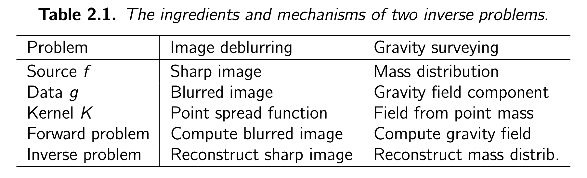
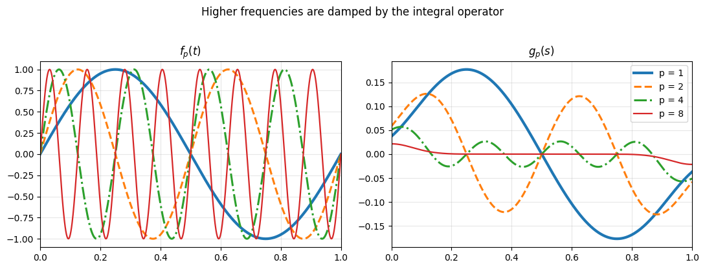
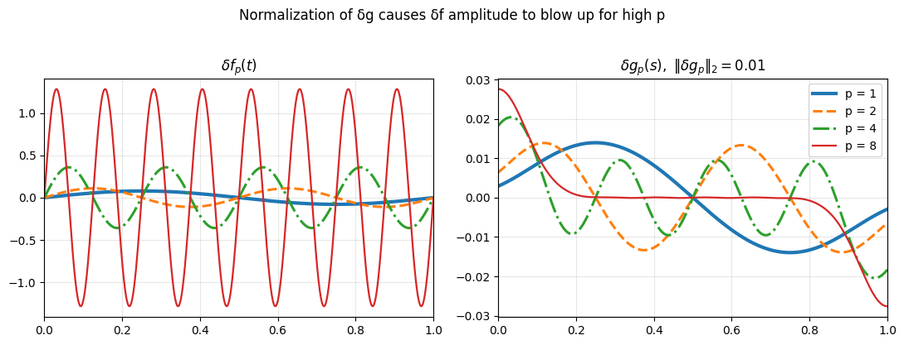

# 02. Fredholm Integral Equation
Fredholm integral equation을 배워보자. Fredholm integral equation of the first-kind는 다음과 같이 정의된다.

\begin{equation}
\int_0^1 K(s, t) f(t) dt = g(s), \quad 0 \leq s \leq 1
\end{equation}

Forward computation에서는 function $f$와 kernel $K$가 주어질 때, $g$를 계산한다. 반면, inverse problem에서는 kernel $K$와 관측된 함수 $g$가 주어졌을 때, 이를 만족하는 $f$를 복원하고자 한다. 여기에서, $f$와 $g$가 선형 관계이기 때문에,  Kernel $K$로 인해 두 함수 관계의 정량적 특성이 결정된다. 

Linear relationship between $f$ and $g$

\[
\begin{aligned}
(Tf)(s) &:= \int_{0}^{1} K(s, t) f(t) dt\\
\\
T(f_1 + f_2)(s) &= \int_{0}^{1} K(s, t) [f_1(t) + f_2(t)] dt\\
&= \int_{0}^{1} K(s, t)f_1(t) dt + \int_{0}^{1} K(s, t)f_2(t) dt\\
&= (Tf_1)(s) + (Tf_2)(s)\\
\\
T(\alpha f)(s) &= \int_{0}^{1} K(s, t)\alpha f(t) dt\\
&= \alpha \int_{0}^{1}K(s, t) f(t) dt\\
&= \alpha(Tf)(s)
\end{aligned}
\]

특히, $K(s, t) = h(s-t)$로 표현될 때, forward problem은 convolution, inverse problem은 deconvolution problem이 된다.

## 1. Examples

- **Image deblurring example**

    만약 해결하고자 하는 문제가 image deblurring이라면, $f$ (source)는 이상적인 원본 이미지, $g$ (data)는 blur가 적용된 관측 이미지, kernel $K$는 영상 시스템의 point spread function(PSF)에 해당한다. 이때, forward problem은 원본 이미지 $f$와 PSF $K$를 통해 blurred image를 얻는 과정이 되고, inverse problem은 blurred image $g$와 known kernel (PSF) $K$가 주어졌을 때 이상적인 원본 이미지 $f$를 복원하는 문제가 된다. 

    여기에서 $f$라는 것이 카메라로 찍은 원본 이미지가 아니라, 이상적인 (실제 존재하는) 이미지로 이해하는것이 좋을 것 같다. $g$가 이러한 이상적인 이미지가 실제 카메라의 광학계와 센서를 거치며 PSF에 왜곡되어 측정한 결과이다. PSF는 카레마 촬영 과정에서 발생하는 blurring 현상을 물리적으로 모델링한 것으로, 측정 시스템의 본질적인 특성을 나타낸다.

- **Gravity surveying example**

    마찬가지로, 해결하고자 하는 문제가 gravity surveying이라면, $f$ (source)는 지하의 질량 분포, $g$ (data)는 지표에서 측정된 중력장 성분, kernel $K$는 단위 점질량이 만들어내는 중력장을 나타내는 함수에 해당한다. 이때, forward problem은 질량 분포 $f$와 커널 $K$가 주어졌을 때 관측 위치에서의 중력장 성분 $g$를 계산하는 과정이 되고, inverse problem은 측정된 중력 데이터 $g$와 알려진 물리 커널 $K$가 주어졌을 때 지하의 질량 분포 $f$를 추정하는 문제가 된다.

    여기에서 $f$는 우리가 직접 관측할 수 없는 지하의 원인에 해당하며, $g$는 그 원인이 물리 법칙(뉴턴의 만유인력 법칙)에 따라 공간적으로 누적되어 나타난 결과에 해당한다. 커널 $K$는 점질량이 관측점에 미치는 중력 기여를 정량화한 것으로, 질량 분포의 각 위치가 관측 데이터에 어떻게 반영되는지를 물리적으로 모델링한다. 따라서 중력 탐지의 inverse problem은 관측된 중력장 데이터로부터 지하 질량 분포를 추정하는 과정이며, 적분 과정이 본질적으로 정보를 smoothing하기 때문에 불안정성이 나타날 수 있다.

- **Model training example**

    딥러닝 모델 학습 관점에 Fredholm integral equation을 적용해보자. 이 관점은 gravity surveying과 매우 유사하다고 볼 수 있다. gravity surveying에서 지하의 보이지 않는 질량 분포 $f$가 중력장 $g$를 만들어 내는 것과 같이, 모델 학습에서는 방대한 데이터 분포 $f$를 통해 학습하여 모델의 가중치 $g$를 형성한다. 구체적으로, $f$는 학습 데이터셋, $g$는 학습된 모델의 가중치로 비유할 수 있고, kernel $K$는 학습 알고리즘 및 모델 구조에 대응되어 데이터의 정보가 가중치에 어떻게 누적될지를 결정하는 물리 법칙 역할을 한다. 여기에서의 forward problem은 학습 데이터셋 $f$을 특정 알고리즘/모델 $K$를 통해 학습하여 $g$를 얻는 일반적인 모델 학습 과정이다. Inverse problem은 학습된 모델 가중치 $g$와 kernel $K$가 주어졌을 때 학습 데이터 $f$를 추정하는 문제이다. 

    중력 탐지에서 여러 질량이 합쳐져 하나의 중력장을 만들 때 정보의 smoothing이 일어나듯, 모델 학습에서는 수많은 학습 데이터를 통해 개별 데이터의 정보가 손실된다. 따라서 $g$에서 $f$를 찾는 inverse problem의 경우, ill-posed problem이다.

- **Model inference example**

    Task가 image classification이라고 해보면, $f$는 이미지, $K$는 학습된 모델, $g$는 모델의 output에 해당한다. forward problem은 고차원 이미지 $f$와 모델 $K$가 주어졌을 때 답변 $g$를 inference하는 과정이고, inverse problem은 모델 $K$와 답변 $g$가 주어졌을 때 이미지 $f$를 추론하는 과정에 해당한다. 이 예시에서 또한 압축된 label $g$로부터 원래의 픽셀 정보 $f$를 재구성하는 것이므로, 해가 유일하지 않고 불안정한 ill-posed problem의 전형적인 모습을 보여준다.

이 모든 예시는 $g(s) = \int_0^1 K(s, t) f(t) dt $ 형태의 first-kind Fredholm integral equation으로 정리할 수 있다. 여기에서 kernel $K$가 정보를 smoothing하는 성질을 가질수록, inverse problem은 수치적으로 불안정한 ill-poseness를 가지게된다.

## 2. Instability in Inverse Problems

Riemann-Lebesgue lemma는 이러한 현상을 수학적으로 증명한다. $f_p$를 다음과 같이 정의하자:

$$ f_p(t) = \sin(2 \pi p t), \quad p = 1, 2, \ldots , $$

임의의 kernel $K$가 있을 때, 다음을 알 수 있다. 

\begin{equation}
g_p(s) = \int_{0}^{1} K(s, t) f_p(t)dt \to 0 \quad \text{for} \quad p\to \infty
\end{equation}

|  |
|:--|
| **Figure 1.** 입력 함수 $f_p(t)$와 대응하는 적분 변환 결과 $g_p(s)$의 비교. 주파수 파라미터 $p$가 커질수록 $g_p(s)$의 진폭이 감쇠되는 것을 확인할 수 있다. 이는 forward problem에서는 고주파가 억제되어 결과물이 매끄러워지는 반면, inverse problem에서는 고주파 증폭으로 인해 불안정성이 발생할 수 있음을 시사한다. |

식 (2)에서, 입력 신호 $f$의 주파수($p$)가 높아질수록 관측 데이터 $g_p$의 크기는 급격히 작아져 결국 0에 수렴하게 된다. 즉, $f$에서 $g$로 가는 과정에서 $f$의 고주파 성분(미세한 디테일)은 damped되고, 결과물인 $g$는 $f$보다 smoothness를 갖게 되는 것이다. Figure 1은 $p$(주파수)가 커짐에 따라 $g$의 값이 작아지는 것을 보여준다. 

역문제는 바로 이 smoothing된 $g$로부터 원래의 $f$를 복원하는 과정이다. 수학적으로 이는 사라진 고주파 성분을 강제로 다시 복원하는 작업과 같으며, 주파수가 높을수록 증폭해야 하는 정도가 기하급수적으로 커진다. 이 과정에서 아주 미세한 측정 노이즈조차 함께 증폭되어 solution을 완전히 왜곡시키기 때문에 inverse problem이 본질적인 불안정성을 갖게 되는 것이다.

|  |
|:--|
| **Figure 2.** 데이터 오차 $\delta g_p$와 이에 대응하는 해의 오차 $\delta f_p$의 관계. 모든 $\delta g_p$의 크기($L_2$ norm)를 $0.01$로 고정했음에도, 주파수 $p$가 증가함에 따라 복원된 $\delta f_p$의 진폭이 급격히 커지는 것을 볼 수 있다. 이는 고주파 노이즈가 inverse problem에서 치명적인 불안정성을 야기함을 보여준다. |

Figure 1이 forward problem에서 고주파 성분이 억제되어 $g$가 0에 가까워지는 것을 보였다면, Figure 2는 이로 인해 발생하는 inverse problem에서의 error amplification을 보여준다. 

Inverse problem에서의 불안정성을 확인하기 위해, 주파수 $p$에서의 관측 데이터 $g_p$에 미세한 노이즈 $\delta g_p$가 포함된 상황을 가정해보자. 이때 $p$에 관계 없이 noise의 크기를 $||\delta g_p||_2 = 0.01$로 일정하게 유지한다. 하지만 이 미세한 노이즈가 역변환을 통해 해 $f$의 오차인 $\delta f$로 복원될 때는 매우 큰 오차가 발생하는 것을 확인할 수 있다. 

Figure 2에서 확인할 수 있듯이, $p$가 커짐에 따라 데이터의 오차 $\delta g_p$에 대응하는 해의 오차 $\delta f_p$의 진폭은 커진다. 이는 Figure 1의 forward problem에서 확인한 고주파 성분의 damping을 역으로 보상하는 과정에서, 아주 작은 노이즈 성분이 증폭되기 때문이다. 

결과적으로, 데이터 $g$에 포함된 노이즈가 아무리 작더라도 그 노이즈가 고주파 성분을 포함하고 있다면, 복원된 해 $f$는 원래의 값에서 크게 멀어진다. 이것이 inverse problem이 갖는 데이터에 대한 해의 비연속성 (stability가 깨짐, Hardamard sense)을 의미한다.

## 3. The Singular Value Expansion and Picard Condition

Singular value exapansion (SVE)는 Fredholm integral equation의 smoothing effect와 해의 존재성을 다룰 수 있게 해준다. 두 함수 $\phi$와 $\psi$가 0과 1사이에서 정의된다고 할 때, 두 함수의 inner product는 

\begin{equation}
\langle \phi, \psi \rangle \equiv  \int_0^1 \phi(t) \psi(t) dt. 
\end{equation}

로 정의한다. 또한, $\phi$의 2-norm 은 다음과 같이 정의한다:

\begin{equation}
||\phi||_2 \equiv \langle \phi, \phi \rangle^{1/2} = \Big(\int_0^1 \phi(t)^2 dt\Big)^{1/2}.
\end{equation}

식 (1)에서의 kernel $K$가 $\int_0^1 \int_0^1 K(s, t)^2 ds\, dt < \infty$를 만족하여 square integrable하면, $K$를 SVE를 통해 분석할 수 있다. $K$를 SVE를 통해 표현하면 다음과 같다:

\begin{equation}
K(s, t) = \sum_{i=1}^\infty \mu_i u_i(s) v_i(t)
\end{equation}

여기에서, 함수 $u_i$와 $v_i$는 각각 left singular function, right singular function이라고 한다. 모든 $u_i$와 $v_i$ 내의 함수들은 식 (4)에서 정의한 inner product에 대해 orthonormal하다. 즉,

$$ \langle u_i, u_j \rangle = \langle v_i, v_j \rangle = \delta_{i, j}, \quad \text{for} \; i = 1, 2, \ldots $$

$\mu_i$는 singular value를 나타내며, 순서대로 monotonic decreasing하는 특성을 갖는다. 즉, 다음이 성립한다.

$$ \mu_1 \geq \mu_2 \geq \ldots \geq 0$$

만약 0이 아닌 특이값 $\mu_i$의 값이 유한하다면, 이 커널을 degeneate kernel이라고 부른다. 이는 행렬의 rank가 유한한 것과 같은 개념으로, degenerate kernel의 inverse problem은 입력 정보의 상당 부분이 $g$에 반영되지 않기 때문에, $f$를 완벽히 복원하는 것이 불가능하거나 심각하게 ill-posed해지는 특성을 갖는다. 
Singular values $\mu$와 함수 $u, v$는 몇 가지 관계식을 따르지만, 가장 중요한 fundamental relation은 다음과 같다. 

\begin{equation}
\int_0^1 K(s, t)v_i(t) dt = \mu_i u_i (s), \quad\text{for}\; i = 1, 2, \ldots.
\end{equation}

Notations

    <ul>
        <li><strong>$K(s, t)$</strong>: Kernel. 시스템의 특성을 나타내는 적분 핵. 입력 신호($t$ domain)를 출력 데이터 ($s$ domain)로 변환하는 물리적 법칙을 모델링</li>
        <li><strong>$\mu_i$</strong>: $i$-th Singular value. $i$가 커질수록 0에 가까워지며, 시스템이 고주파 정보를 얼마나 강력하게 damping할지 결정함.</li>
        <li><strong>$v_i(t)$</strong>: Right singular function. 해 공간의 정규직교 기저. $i$가 커질수록 높은 주파수로 진동하며, 복원하고자 하는 $f$의 세부 디테일을 표현함.</li>
        <li><strong>$u_i(s)$</strong>: Left singular function. 데이터 공간의 정규직교 기저. 입력 $v_i$가 시스템 $K$를 통과한 후 관측 데이터 $g$에서 나타나는 대응 성분.</li>
        <li><strong>$K^*(t, s)$</strong>: Adjoint kernel. 데이터 공간의 성분을 다시 해 공간으로 매핑 (inverse problem에서 활용)</li>
    </ul>

식 (6)의 fundamental relation에서 kernel $K$가 입력 신호 $v_i$를 출력 신호 $u_i$로 매핑할 때, 그 가중치가 $\mu_i$임을 보여준다. $i$가 증가함에 따라 $\mu_i$는 0으로 수렴하기 때문에, forward problem에서는 고주파 성분 $v_i$가 damping되어 $g$가 smoothing되는 원인이 된다. 

반면, inverse problem에서는 관측된 데이터 $g$로부터 $f$의 성분을 추출하는 과정이다. 식 (6)은 forward 방향의 매핑을 보여준다. inverse problem을 이해하기 위해서는 $g$의 기저 $u_i$로 부터 $f$의 기저 $v_i$를 찾는 과정을 살펴봐야 한다. SVE의 adjoint relation에 의해 다음이 성립한다. 

\begin{aligned}
&\int_0^1 K^*(t, s) u_i(s) ds = \mu_i v_i(t) \\
&v_i(t) = \frac{1}{\mu_i} \int_0^1 K^*(t, s) u_i(s) ds 
\end{aligned}

성분 $u_i$로 부터 $v_i$를 복원하고자 할 때 $1/\mu_i$라는 계수가 관여하게 된다. $i$가 커질수록 $\mu_i \to 0$이기 때문에, inverse problem을 푸는 과정에서는 $1/\mu_i$의 매우 큰 가중치를 곱하게 되고, 이것은 고주파 노이즈가 증폭되는 이유이다. 

하지만, SVE는 이론적으로 완벽하지만 closed-form solution을 구할 수 있는 경우가 드물다. 따라서 실제 문제를 해결할때는 수치적으로 계산 가능한 singular value decomposition (SVD)를 활용하게 된다.

