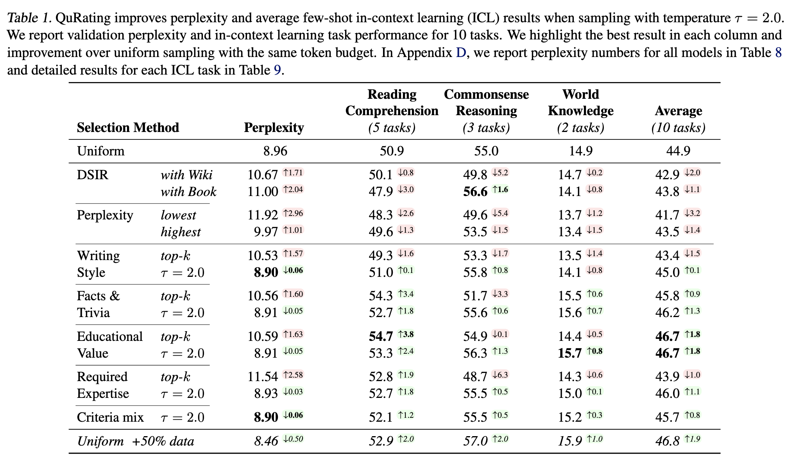
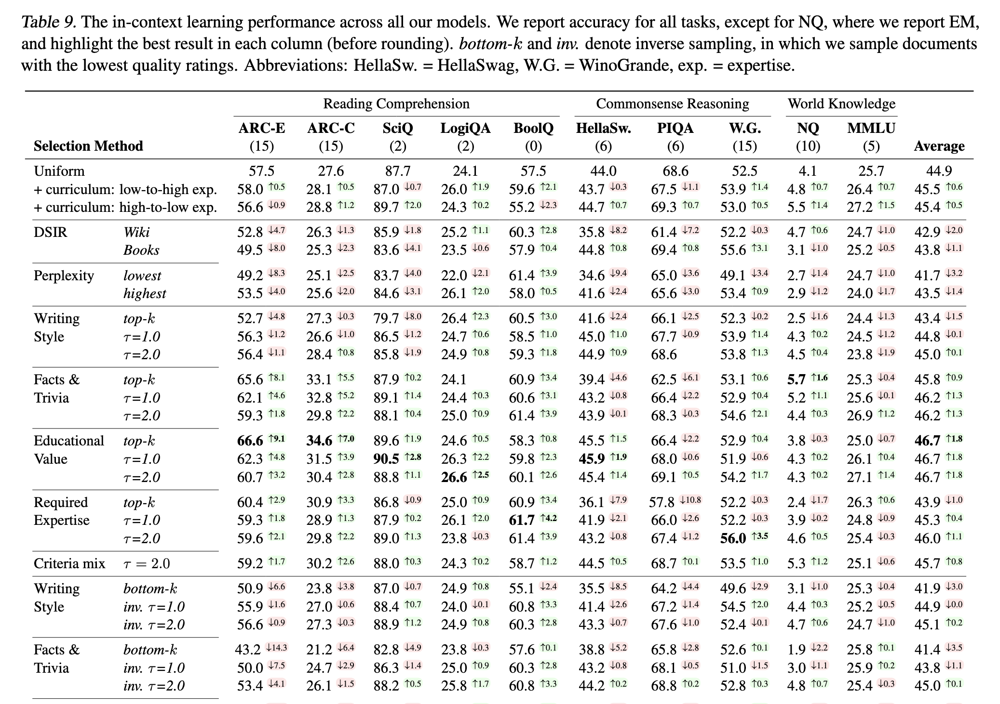

# QuRating

##### _Wettig et al._ QuRating: Selecting High-Quality Data for Training Language Models _(2024 ICML)_

## 1. 논리의 흐름 (The Logic Flow)

### **문제 정의 (Problem Definition):**

LLM from scratch 하기전에 모델 성능에 도움이 되는 데이터만을 골라서, 학습시킬 수 없을까?

### **노벨티 (Novelty):**

- 데이터 "품질"을 perplexity·도메인 규칙 같은 휴리스틱이 아니라 **LLM의 pairwise 선호 판정**으로 정의.
- 그 판정을 **스칼라 품질 점수로 학습한 큐레이터(reward model 형태)**로 만들어, 소수 비교만으로 260B 토큰 전체에 점수를 매김.
- 점수를 top-k로 자르지 않고 **temperature 샘플링**으로 "품질 vs 다양성"을 한 축에서 조절.

### **Key Method:**

- gpt모델을 통해 데이터를 글A, 글B 중 어느 정도의 confidence로 나은지 annotation 하고, 그 값들을 바탕으로 글의 점수를 매기는 큐레이터 모델 학습
  - 판정자는 **GPT-3.5-turbo**, SlimPajama에서 뽑은 **약 250K 쌍**을 pairwise 비교 (200K는 전체 도메인, 5개 전문 도메인별로 10K씩 추가).
  - 이 떄 질문은 writing style(문체) / required expertise(요구 전문성) / facts & trivia(사실·상식) / educational value(교육적 가치)
  - **confidence (타깃 만들기):** 한 쌍을 순서 바꿔가며 **20번 판정** → 승률로 confidence $p_{B\succ A}=\frac{\text{B 승}}{20}\in[0,1]$ 를 얻음 (순서 뒤집기는 위치 편향 상쇄용).
  - **loss (학습):** 각 글에 잠재 점수 $s_\theta(t)$ 를 두고 $p_{B\succ A}=\sigma(s_B-s_A)$ 로 가정. confidence를 타깃으로 cross-entropy 학습

$$
\mathcal{L}=-p_{B\succ A}\log\sigma(s_B-s_A)-(1-p_{B\succ A})\log\sigma(s_A-s_B)
$$

- 큐레이터 모델의 점수를 기반으로 데이터 구성
  - 핵심 트릭: 점수를 그대로 top-k로 자르지 않고 **점수를 logit으로 둔 temperature 샘플링(τ)**. τ→0이면 top-k, τ→∞면 uniform. 즉 "품질 vs 다양성"을 τ 하나로 조절. 최종 산출물이 260B 토큰 **QuRatedPajama**(SlimPajama 기반) 코퍼스.

### **컨트리뷰션 (Contribution / Impact):**

- educational value로 뽑은 데이터로 학습시켰을 때, **uniform(random)이 50% 더 많은 스텝을 돌려야 따라잡는 성능**
- 똑같은 데이터 구성이라 하더라도, 평점 순서로 학습시키는 것이 랜덤 순서보다 성능이 좋음(커리큘럼 효과).

## 2. 검증과 증명 (Verification)

### **메인 결과:** 제안하는 방법의 우수성을 입증하는 결정적 수치나 그래프

<figure markdown="span">
  { width="90%" }
</figure>

1. perplexity 기반으로 선택하는것이 uniform으로 선택하는것보다 성능이 안좋음.
2. 평점 높은것만 선택(top-k)하기보다는 약간의 랜덤성을 주는 것이 모델 성능을 높임. 오히려 top-k(τ→0)는 **uniform보다도 나쁨**
   도메인별 샘플링으로 특정 기준의 효과를 분리해서 봄.

## 3. 비판적 사고 (Critical Thinking)

### **한계점 (Weaknesses / Limitations):**

<figure markdown="span">
  { width="90%" }
</figure>

아이러니하게, 평점 낮은 것만 뽑아도, 랜덤으로 뽑는것보다, 성능이 좋은 영역이 있음.
-> 이러면 평점으로서의 의미가 있나.

- 저자는 distilation이라고 볼 수 없다하지만, 결국 평점에는 모델의 선호가 남아 있으니 상위 모델의 bias가 낄거 같음.(Figure4에도 영어 편향이 있음)
- educational value에서만 성능이 두드러진 것을 보면, 결국에 질문 구성이 중요해보임.
- 학습 모델이 **1.3B 하나**. 다른 스케일에서는?
- 특정 상황(Edge case)에서 실패할 가능성은 없는가?
  - 영어·일반 웹 텍스트 편향 → **비영어/코드/수학** 같은 도메인에선 "품질" 정의가 무너질 수 있음. 판정자가 못 보던 분포에서 점수가 노이즈가 될 위험.

### **내 연구에의 적용 (Action Plan):**

instruction following 말고 다른 영역에서도 어떨지 궁금함. 예를들어 gpt에게 어떤 글이 더 사람글 같아? 라고 물어보고, 그 데이터로만 학습시켰을때, 더 사람같은 글이 써지는지
