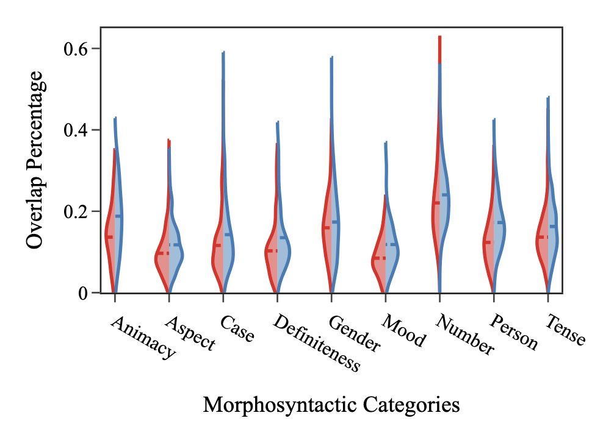
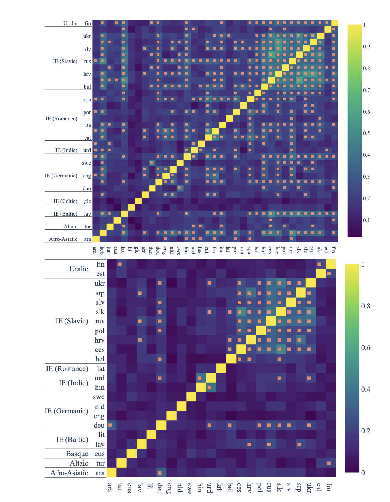
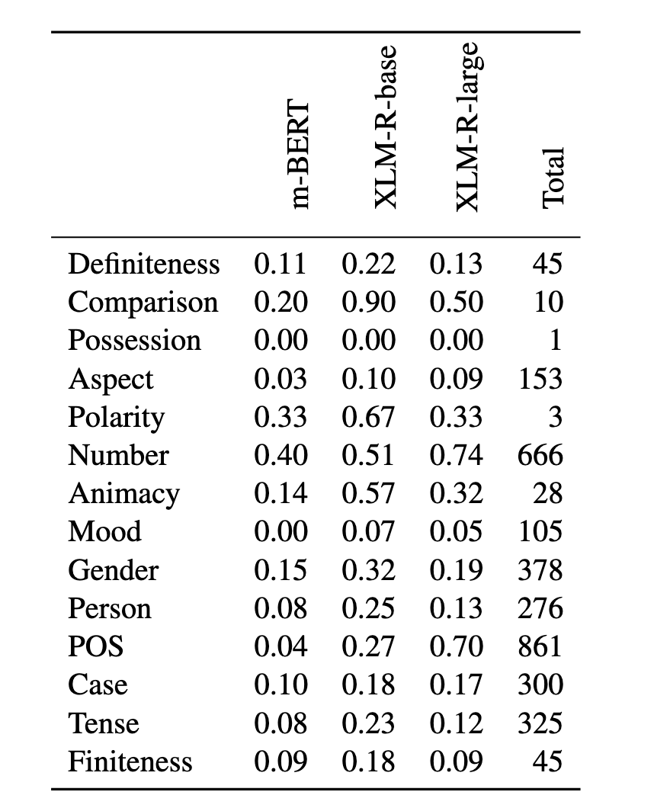
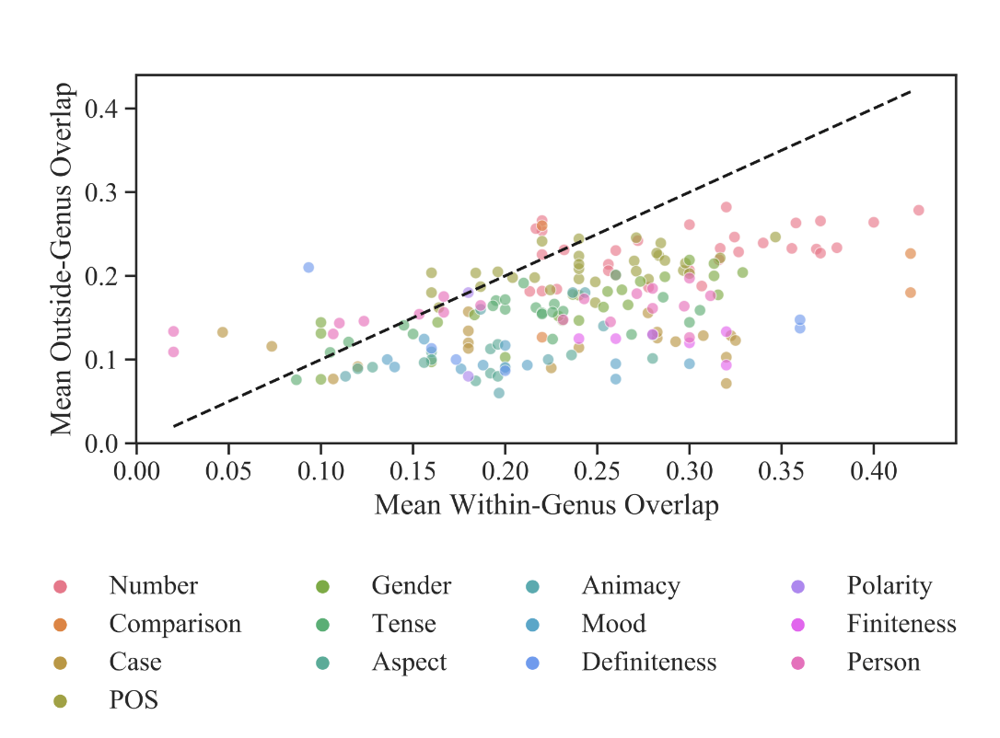
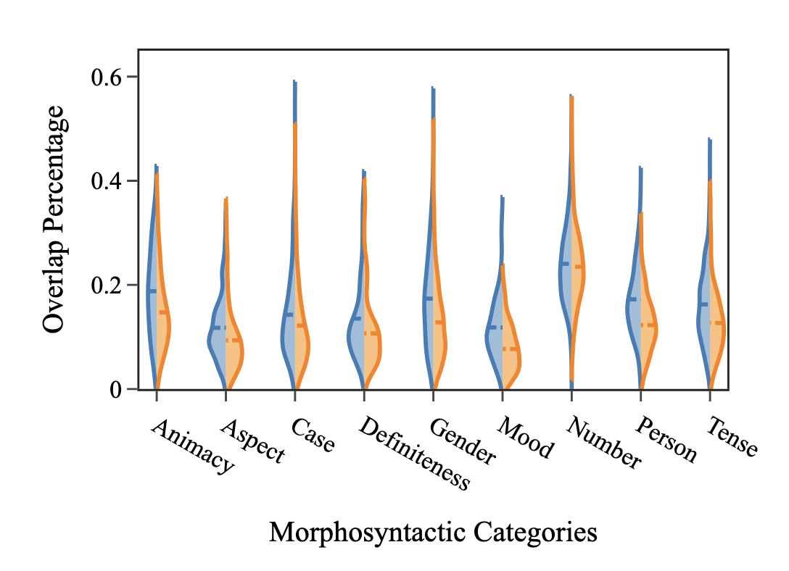
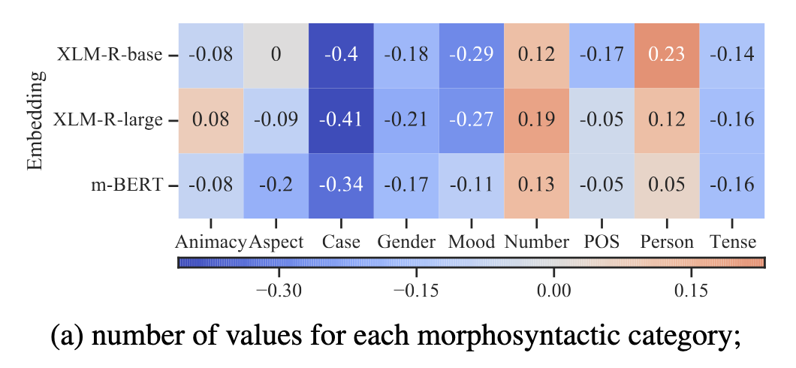
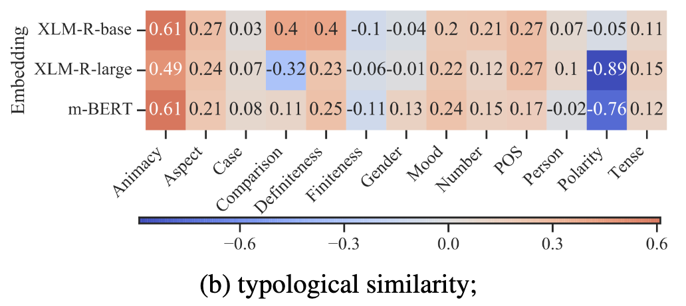
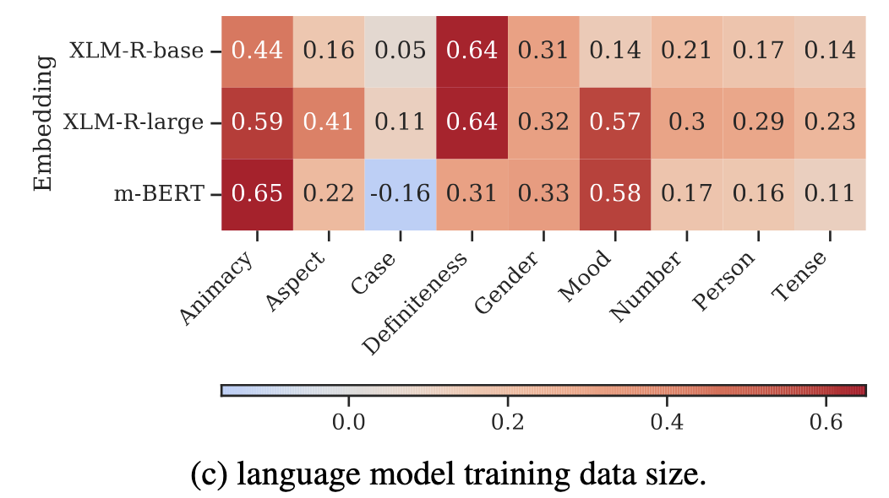

# Same Neurons, Different Languages

##### _Stanczak et al._ Same Neurons, Different Languages: Probing Morphosyntax in Multilingual Pre-trained Models _(2022 NAACL)_

## 1. 이 논문이 보이고 싶은 것

> 각각의 언어의 문법에는 비슷한 부분들이 있을텐데 LM들의 뉴런도 비슷하게 활성화 될까
> -> 즉 한국어에도 높임법이 있고, 일본어에도 높임법이 있는데, 활성화되는 뉴런이 똑같을까?

## 2.어떻게 보일건데

### 2.0 큰 와꾸

1. 언어마다 뉴런에 대해 특정 문법자질의 분포를 예측하게 하는 모델을 만듦 (input: (단어, 뉴런 조합), output: 문법 자질들의 분포)
   예를들어, 여쭙다라는 단어와 3번 뉴런이 들어가서, [높임: 0.8, 낮춤: 0.2]가 출력 되는 모델.
2. 문법 자질에 대해 가장 설명력이 높은 top 50개의 뉴런을 뽑음.
3. 언어 쌍 간 그 뉴런들이 겹치는 지 확인
   한국어에서의 높임 뉴런과 일본어에서의 높임 뉴런이 겹치는지

### 2.1. 모델 학습

어떤 dimension이 특정 문법을 잘 설명 할 수 있을지 찾을거임

조금 더 수학적으로 말하면:
단어 임베딩 h와 특정 뉴런 조합 C가 주어졌을 때, π(문법 범주 값)를 얼마나 잘 설명(예측)하는 probe($\theta$)를 학습 할거임

$$
p_{\boldsymbol{\theta}}(\pi \mid \boldsymbol{h}) = \sum_{C \subseteq D} p_{\boldsymbol{\theta}}(\pi \mid \boldsymbol{h}, C)\, p(C)
\tag{1}
$$

log-likihood 최대화 되게 $\theta$ 학습

$$
\mathcal{L}(\boldsymbol{\theta}) = \sum_{n=1}^{N} \log \sum_{C \subseteq D} p_{\boldsymbol{\theta}}(\pi^{(n)}, C \mid \boldsymbol{h}^{(n)})
\;\geq\;
\sum_{n=1}^{N} \left( \mathbb{E}_{C \sim q_{\boldsymbol{\phi}}} \left[ \log p_{\boldsymbol{\theta}}(\pi^{(n)}, C \mid \boldsymbol{h}^{(n)}) \right] + \mathrm{H}(q_{\boldsymbol{\phi}}) \right)
\tag{2}
$$

(1)에서 (2) 넘어가는건 자명하다.

### 2.2 top 50 뉴런 뽑기

$\theta$가 학습이 되면, 해당 문법을 가장 잘 설명하는 k개의 dimension을 뽑고 얘를 분석할거임.

$$
C_k^{\star} = \operatorname*{argmax}_{\substack{C \subseteq D \\ |C| = k}} \log p_{\boldsymbol{\theta}}(C \mid \mathcal{D})
\tag{3}
$$

### 2.3 결과

#### 카테고리별

<figure markdown="span"> { width="90%" }</figure>

#### 언어쌍 별로

<figure markdown="span"> { width="90%" }</figure>

주황색 네모는 유의미하게 겹침을 나타냄.

#### 유의미한 언어쌍 비율

<figure markdown="span"> { width="70%" }</figure>

## 3. 그래서 어떤 요소가 겹침을 크게 만드는데

### 같은 어족

<figure markdown="span"> { width="80%" }</figure>

어족이 같으면 더 겹침

### 모델 크기

<figure markdown="span"> { width="90%" }</figure>
모델이 커질수록 덜 겹침

### 문법자질의 값 개수

<figure markdown="span"> { width="90%" }</figure>
문법 카테고리가 가질 수 있는 값의 종류가 많을수록 겹침이 덜해짐

### 유형론적 유사도

<figure markdown="span"> { width="90%" }</figure>
통사 유형이 비슷할수록 겹침이 강해짐
단, animacy는 상관이 제일 강한데, 사실 슬라브어족에만 거의 국한된 카테고리라서.

### 사전학습 데이터 크기

<figure markdown="span"> { width="90%" }</figure>

데이터가 많을수록 겹침도 커짐
데이터 많음 → 표현의 질 좋음 → 언어 간 더 얽힘(entangled), 라는 해석.

## 4. 아쉬운 점

단어 뜻만 보고 맞춘건지 진짜 문법을 이해한건지 잘 모르겠음.

- Comparison(비교급)은 예를 들어, "more/most" 같은 고빈도 기능어로 표시됨 → 임베딩이 문법을 "이해"해서가 아니라 그냥 그 서브워드 토큰 자체의 표면적 패턴을 읽어내는 것일 수 있음
- Polarity(부정)도 "not/no/ne" 같은 별도의 고빈도 어휘 항목으로 실현되는 경우가 많음 → 마찬가지로 "부정어라는 단어가 있는지 없는지"를 감지하는 것에 가까울 수 있음
- number(수일치)도 a, is, are ... 걍 단어 보고 맞춘거 아님?
- 반면 Case/Tense/Aspect는 같은 어간에 다른 굴절이 붙는 방식이라, 표면형만 봐서는 절대 유추가 안 되고 실제로 문맥/형태통사 정보를 계산해야 함
